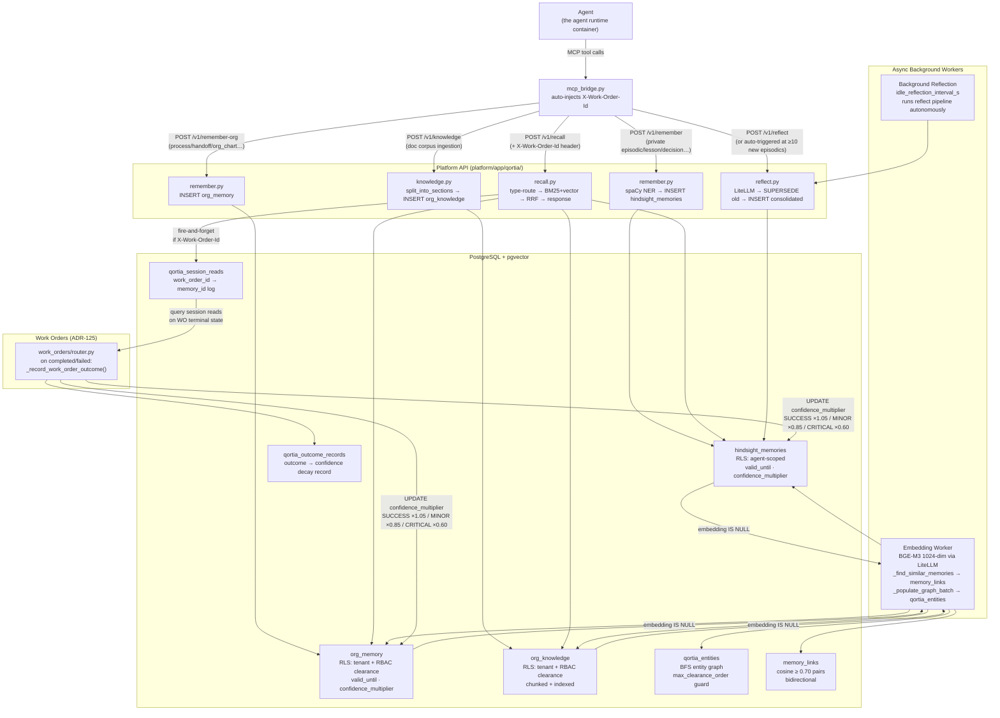
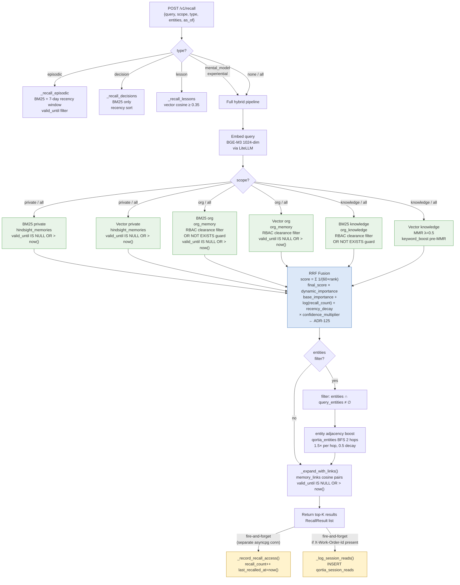
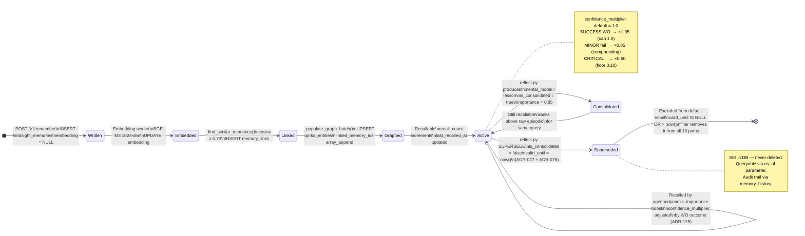
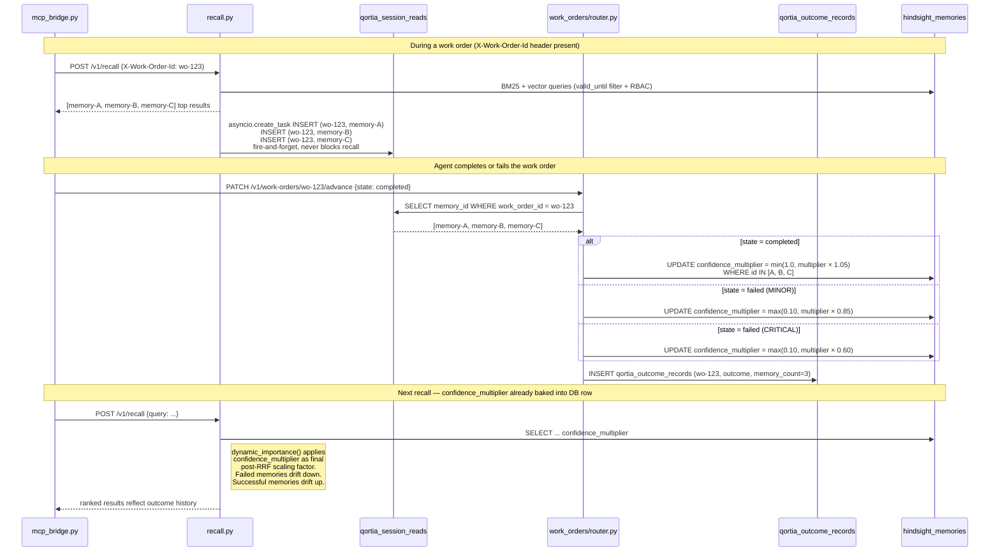

# Qortia — System Overview

Read this first. Four diagrams that show the complete picture in order of complexity.
For detailed SQL, ADR rationale, and API schemas see [`01-design.md`](01-design.md) and
[`recall-pipeline.md`](../architecture/diagrams/recall-pipeline.md).

---

## 1. Component Map — What Connects to What

Every write, read, and async background job across the Qortia memory layer.

---

## 2. Recall Pipeline — One Request End to End

Every path a `POST /v1/recall` request can take, including filters, scoring, and post-response side effects.

---

## 3. Memory Lifecycle — From Write to Decay

How a single memory travels from creation through to irrelevance.

---

## 4. ADR-125 Causal Feedback Loop

How work order outcomes flow back into memory quality scores.

---

## Reading Order

| Want to understand… | Read |
|---|---|
| How the pieces connect (this page) | `docs/qortia/00-overview.md` |
| Data model, SQL, ADR rationale | [`01-design.md`](01-design.md) |
| Recall SQL details, sequence diagrams | [`recall-pipeline.md`](../architecture/diagrams/recall-pipeline.md) |
| How to measure and benchmark quality | [`02-benchmarking.md`](02-benchmarking.md) |
| Eval harnesses and current scores | [`03-eval-strategy.md`](03-eval-strategy.md) |
| API request/response schemas | [`04-api-contracts.md`](04-api-contracts.md) |
| All shipped ADRs | [`decisions/qortia.md`](../decisions/qortia.md) |
